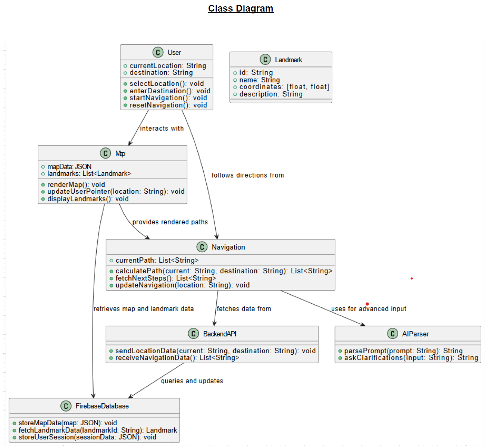
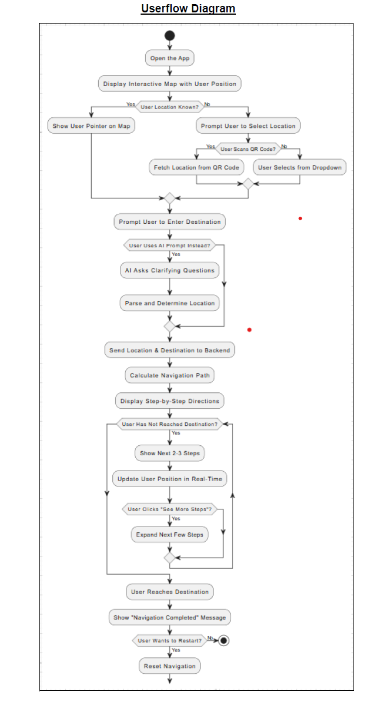

# Indoor Navigation System (IndoorNav) project documentation.

## IT Development Project

### Team Members  
- **Front End:** Kiran, Aiden, Zach  
- **Back End:** Arijit, Gursaroop, Gurneet  

---

## 1. Introduction  
The **Indoor Navigation System** (IndoorNav) aims to provide an **interactive, real-time indoor navigation system** tailored to large indoor spaces like educational institutions. Leveraging **MapboxGL**, **AI-enhanced location services**, and **dynamic pathfinding algorithms**, this project is designed to enhance accessibility, offer real-time assistance, and simplify navigation within Vancouver Community College (VCC).

---

## 2. Problem Statement
Navigating large and complex buildings, such as college campuses, shopping malls, airports, and museums, can be a frustrating and time-consuming experience for students, faculty, visitors, and staff. Traditional navigation methods are often inefficient, outdated, and difficult to interpret in real-time.

Students frequently struggle to locate their classrooms, labs, and administrative offices, especially during their first weeks on campus. Visitors and event attendees often need guidance to reach specific locations without the need to ask for directions. Additionally, accessibility users may face significant challenges in finding the most suitable routes that accommodate their mobility needs.

There is currently no real-time indoor navigation system that provides step-by-step guidance tailored to user preferences. This results in confusion, delays, and an over-reliance on information kiosks, signage, and personal staff assistance, which may not always be readily available.

The Indoor Navigation Solver aims to address these issues by providing an interactive real-time navigation solution that dynamically generates step-by-step directions, ensuring an efficient and seamless navigation experience for all users.

---

## 3. Core User Stories & Problem Statements
- **New students struggle to find classrooms and offices.**  
- **Visitors lack clear directions to key areas like administration, libraries, and cafeterias.**  
- **Existing navigation tools (Google Maps) do not support indoor navigation accurately.**  
- **Users with accessibility needs require optimized routes (elevators, ramps, accessible paths).**  

---

## 4. Features & Functionalities  

### 4.1. Front-End: Interactive Map & Navigation  
#### Landing Page & Map Features  
- **Interactive Map Rendering:**
  - Uses **MapboxGL** to display a **zoomable, draggable, and orientation-aware** map.  
  - Users can click on landmarks to view pop-ups with:
    - **Images**  
    - **Descriptions** (room name, faculty name, office hours, services available).  

#### Navigation Input & User Interaction
- **Current Location Input:**
  - Dynamic dropdown for selecting known landmarks.  
  - QR code scanning to determine current location.  
- **Destination Selection:**
  - Dropdown menu for available locations.  
  - Optional **voice input** for accessibility.  
  - Suggested destinations based on **proximity or user history** (wishlist).  

#### Real-Time User Pointer & Orientation
- Displays the **user’s position** on the map.  
- Updates orientation dynamically (based on device sensors or manual input).  
- Highlights **nearby landmarks** within walking distance.  

#### Step-by-Step Navigation
- **Path Rendering:** Displays optimal navigation route using **Dijkstra’s or A* algorithm**.  
- **Real-Time Guidance:** Step-by-step direction updates as the user progresses.  
- **Mini-Map Preview:** Animated path visualization (GIF format).  
- Users can **reset navigation** or **recalculate routes** on demand.  

#### Advanced Features (Optional Enhancements)
- **AI-Assisted Navigation:** OpenAI API bot assists users with text-based queries.  
- **Image Recognition:** Users can take a photo to determine their location (wishlist feature).  
- **Augmented Reality (AR) Overlay:** Future expansion to display directional arrows over real-world images.  

---

### 4.2. Back-End: Route Calculation & Real-Time Data Handling  
#### Location & Navigation Logic
- **Default Location Assignment:** GPS/Wi-Fi based initial positioning (if available).  
- **Current Location Updates:** Received from front-end via dropdown, QR scan, or AI processing.  
- **Destination Handling:** Stores and processes user-selected destinations.  
- **Path Calculation:**  
  - Uses **Dijkstra’s** or **A* algorithm** to compute the shortest route.  
  - Generates step-by-step navigation breakdown.  
  - Takes **elevation changes, accessibility factors, and real-time obstructions** into account.  

#### Step-by-Step Route Distribution
- Sends navigation steps to the front end in **small chunks (2-3 steps at a time).**  
- Continuously updates based on user progress.  

#### AI-Enhanced Features
- **Text-Based Query Processing:** AI bot understands user queries and dynamically provides navigation help.  
- **Smart Suggestions:** Nearby locations suggested based on movement patterns or frequently visited locations.  

---

### 4.3. Database: Storing Map Data & Navigation Paths  
#### Map & Landmark Storage
- **JSON Format:** Stores campus layout, room dimensions, and path connections.  
- **Image Data:** Optional **PNG format** maps for AI recognition and visual aid.  
- **Metadata:** Stores faculty info, services, and room descriptions.  

#### User Session Data
- **Session Cache:**  
  - Current location  
  - Destination  
  - Navigation progress  
- **User Preferences:** Preferred navigation settings, history of searches, and accessibility needs.  

---

## 5. Tech Stack

| **Component** | **Technology** |
|--------------|----------------|
| **Frontend** | React, MapboxGL |
| **Backend** | Node.js, Express |
| **Database** | Firebase (Firestore for real-time updates) |
| **AI Features** | OpenAI API for natural language processing |
| **Hosting** | Vercel, Firebase Hosting |
| **Navigation Algorithm** | Dijkstra’s Algorithm / A* |

---

## 6. Future Enhancements & Scalability

| **Feature** | **Purpose** |
|------------|------------|
| **Indoor Positioning System (IPS)** | Bluetooth/Wi-Fi-based location tracking |
| **AR Navigation** | Augmented reality overlay for intuitive directions |
| **Multi-Floor Navigation** | Support for multi-level buildings with elevators & stairs |
| **Integration with Campus Services** | Class schedules, event locations, emergency exits |
| **Native Mobile App Expansion** | Convert PWA to iOS/Android native app |

---

## 7. Team Responsibilities

| **Team Member(s)** | **Role & Responsibilities** |
|------------------|--------------------------|
| **Kiran, Aiden, Zach (Frontend)** | Develop MapboxGL UI, user interactions, QR scanning, navigation UI |
| **Arijit, Gursaroop, Gurneet (Backend)** | API development, pathfinding logic, Firebase integration |
| **Database Management** | Maintain JSON map layouts, metadata, and session caching |

---

## 8. Conclusion  
The **Indoor Navigation Problem Solver** (IndoorNav) is an **innovative, scalable, and practical** solution to the challenges of indoor wayfinding in large educational institutions. By leveraging **AI-enhanced location processing**, **real-time navigation**, and a **mobile-first PWA approach**, this system ensures an intuitive and seamless user experience.  

This project not only improves **accessibility and efficiency** but also sets the foundation for broader applications in **shopping malls, airports, hospitals, and smart cities**.

🚀 **Ready to transform indoor navigation!** 🚀  

---

